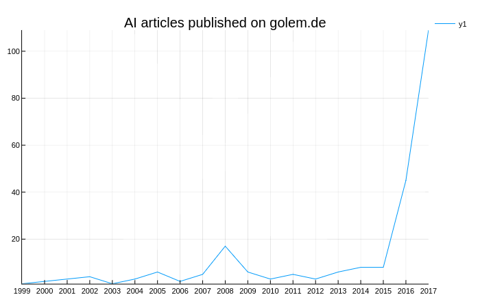

# Simple Scraper

I was wondering how much articles about "Artificial Intelligence" where published in the last few years. So I wrote this scraper to extract some data from [Golem](https://www.golem.de) and [Spiegel](http://www.spiegel.de). Of course this is no scientific research. You can see this little project as an example for a simple scraper written in Julia.

## Dependencies

Add the following packages to Julia
```Julia
julia> Pkg.add("Cascadia")
julia> Pkg.add("Plots")
julia> Pkg.add("PlotlyJS")
```

## Run the scrapers
I recommend using the [Juno IDE](http://junolab.org) (or add some packages to [Atom](https://atom.io): [uber-juno](https://github.com/JunoLab/uber-juno)) to run the code. Otherwise the plotting might not work.

> You can evaluate your Julia code inline by navigating your cursor to the appropriate code and hitting `Ctrl+Enter`. This will run the code block that the cursor is contained in. [...] To specifically choose which code to evaluate, highlight the appropriate parts and use `Ctrl+Enter`.

-> see [Juno Documentation](http://docs.junolab.org/latest/man/basic_usage.html)

## Results (Example)
Number of artilcles published in the category "künstliche Intelligenz" (ai) on golem.de:

