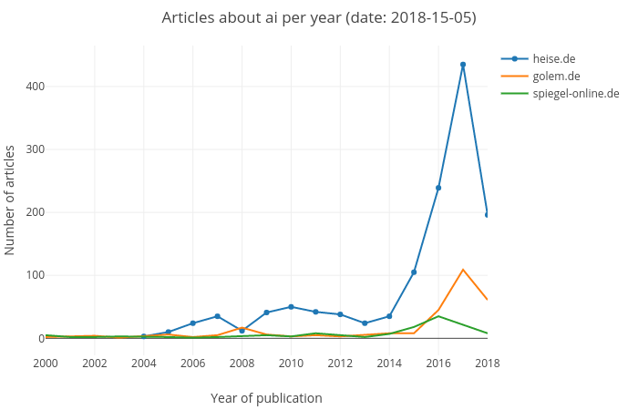

# News Scraper

I was wondering how much articles about "Artificial Intelligence" where published in the last few years. So I wrote this scraper to extract some data from [heise.de](https://www.heise.de), [golem.de](https://www.golem.de) and [spiegel-online.de](http://www.spiegel.de).

## Dependencies

Add the following packages to Julia
```Julia
julia> Pkg.add("Cascadia")
julia> Pkg.add("PlotlyJS")
```

## Run the scrapers
The Have a look at the `main.jl` file. There you can see how to run the different scrapers.

I recommend using the [Juno IDE](http://junolab.org) to run the code (or add some packages to your [Atom](https://atom.io): see [uber-juno](https://github.com/JunoLab/uber-juno)). Otherwise the plotting might not work.

> You can evaluate your Julia code inline by navigating your cursor to the appropriate code and hitting `Ctrl+Enter`. This will run the code block that the cursor is contained in. [...] To specifically choose which code to evaluate, highlight the appropriate parts and use `Ctrl+Enter`.

-> see [Juno Documentation](http://docs.junolab.org/latest/man/basic_usage.html)

## Results
Each of the three scraped websites provide a category with all articles about artificial intelligence. These articles are counted. You can see the results below.



Source:
* [heise.de - Künstliche Intelligenz](https://www.heise.de/thema/Künstliche-Intelligenz/)
* [golem.de - Künstliche Intelligenz](https://www.golem.de/specials/ki/)
* [spiegel-online.de - Künstliche Intelligenz](http://www.spiegel.de/thema/kuenstliche_intelligenz)
